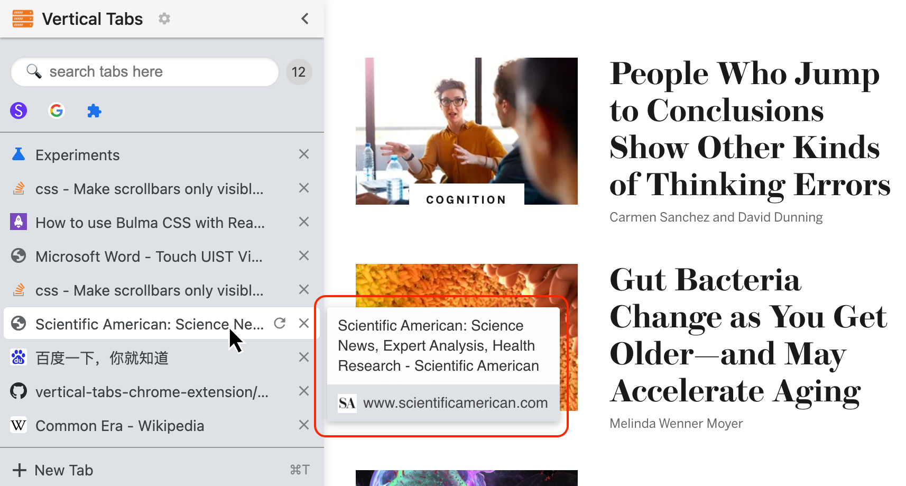
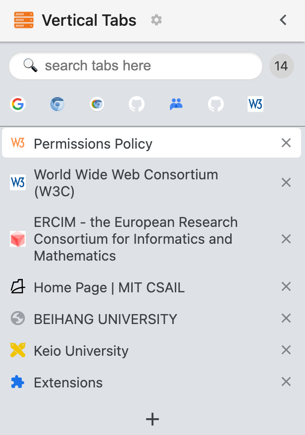
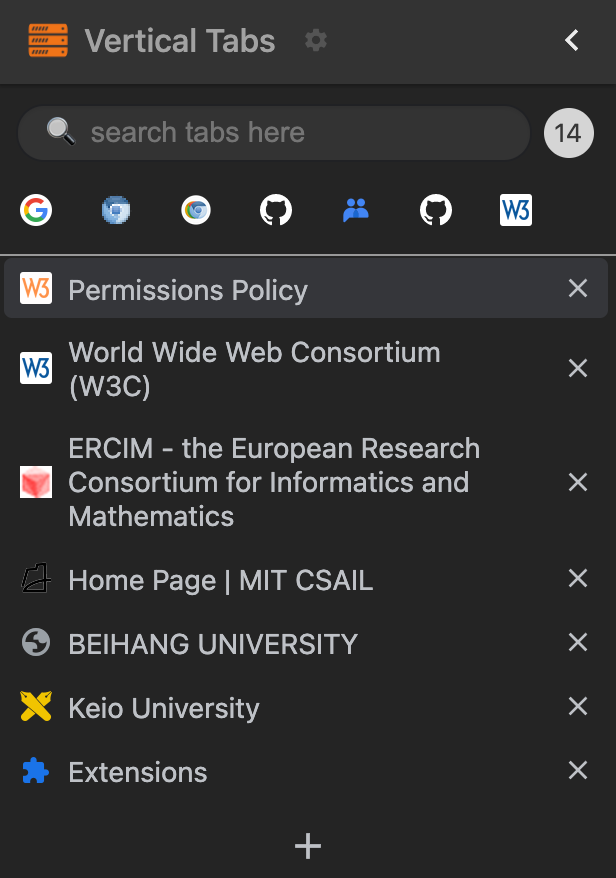
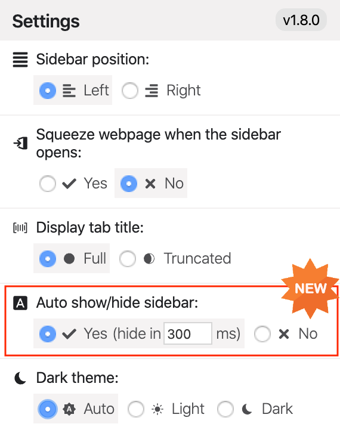
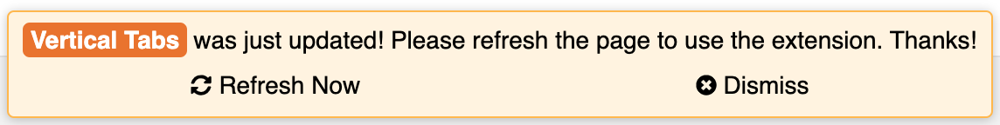
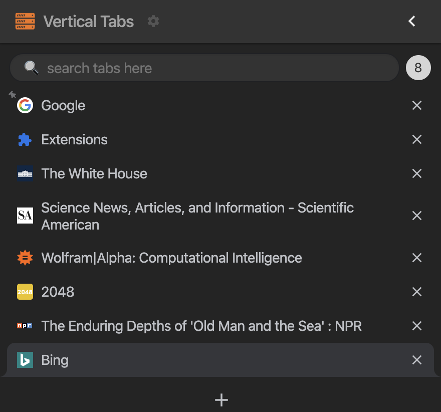
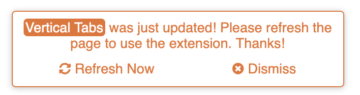
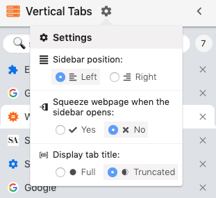
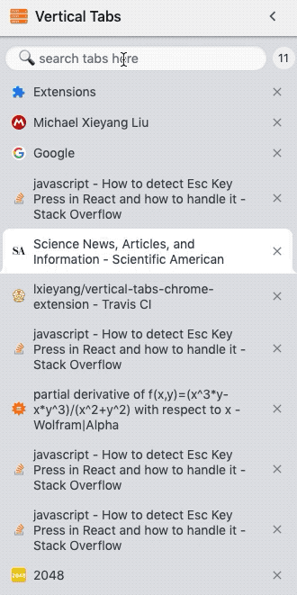
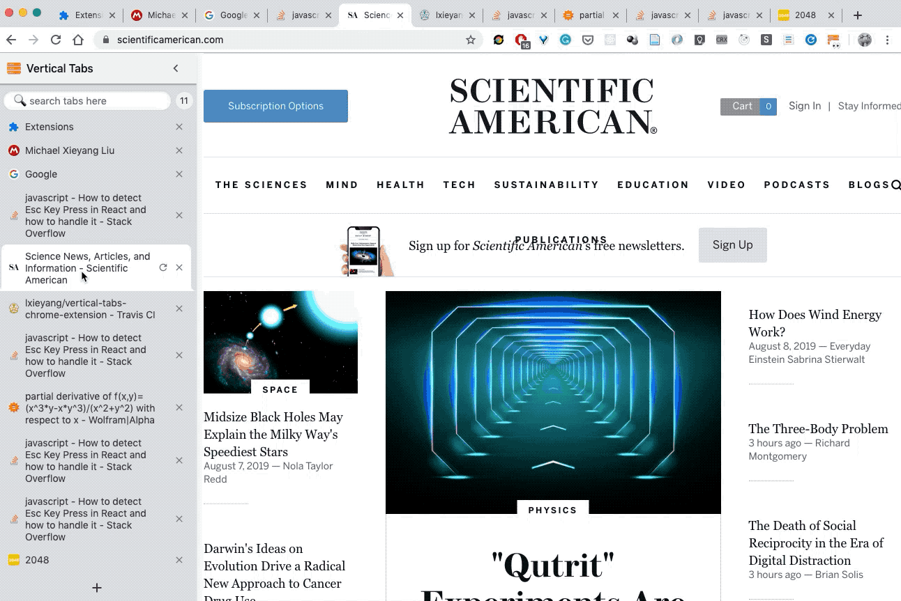

# Release Notes and Change Log

All notable changes to this project will be documented in this file.

Please provide valuable feedback by:

- Creating a [new issue](https://github.com/lxieyang/vertical-tabs-chrome-extension/issues/new)
- Email: xieyangl@cs.cmu.edu

---

# v2.x (official releases)

### [2.0.0](https://github.com/lxieyang/vertical-tabs-chrome-extension/releases/tag/v2.0.0) (2021-10-21)

#### New Features

- Tab Preview

  
   
  

---

# v1.x (official releases)

### [1.10.0](https://github.com/lxieyang/vertical-tabs-chrome-extension/releases/tag/v1.10.0) (2021-10-18)

#### New Features

- Bug fixes
- Smoother drag experience

### [1.9.1](https://github.com/lxieyang/vertical-tabs-chrome-extension/releases/tag/v1.9.1) (2021-10-17)

#### New Features

- Refreshed styles

  
  

### [1.8.0](https://github.com/lxieyang/vertical-tabs-chrome-extension/releases/tag/v1.8.0) (2020-04-05 #StayingAtHome #TogetherWeBeatCOVID19)

#### New Features

- Automatically show/hide sidebar ([#27](https://github.com/lxieyang/vertical-tabs-chrome-extension/issues/27)):

  _Simply move your mouse cursor to either side (depending on your chosen sidebar position, see the first setting entry) of the window to open the sidebar. Once your cursor moves away, the sidebar will automatically close._

  

- Refreshed "Update Notice":

  

#### Other

- Updated development dependencies
- Bug fixes and improvements

 

### [1.7.1](https://github.com/lxieyang/vertical-tabs-chrome-extension/releases/tag/v1.7.1) (2020-01-24 Lunar New Year Eve!)

- Optimize dark mode implementation.
- Add version number in **Settings**.

 

### [1.7.0](https://github.com/lxieyang/vertical-tabs-chrome-extension/releases/tag/v1.7.0) (2020-01-23)

- Added **Copy Tab URL** feature in the context menu as suggested in [#24](https://github.com/lxieyang/vertical-tabs-chrome-extension/issues/24).

- New context menu styles with icons:

  

 

### [1.6.1](https://github.com/lxieyang/vertical-tabs-chrome-extension/releases/tag/v1.6.1) (2020-01-19)

- Fixed [#23](https://github.com/lxieyang/vertical-tabs-chrome-extension/issues/23) by removing `iframe-background.gif` after load.

 

### [1.6.0](https://github.com/lxieyang/vertical-tabs-chrome-extension/releases/tag/v1.6.0) (2020-01-06)

- **Mute** tabs with a single click.
- Fixed a bug regarding the context menu

 

### [1.5.1](https://github.com/lxieyang/vertical-tabs-chrome-extension/releases/tag/v1.5.1) (2019-12-29)

- Fixed a bug where the `new URL()` API returns invalid.
- Removed redundant code on search bar auto focus.

 

### [1.5.0](https://github.com/lxieyang/vertical-tabs-chrome-extension/releases/tag/v1.5.0) (2019-12-26)

- Dark theme support! 🕶️🕶️🕶️

 

### [1.2.1](https://github.com/lxieyang/vertical-tabs-chrome-extension/releases/tag/v1.2.1) (2019-12-01)

- Remove `AutoFocus` feature.
- Updated dependencies.

 

### [1.2.0](https://github.com/lxieyang/vertical-tabs-chrome-extension/releases/tag/v1.2.0) (2019-09-01)

- Prompt users to refresh pages after the extension got updated to a newer version.

 

### [1.1.0](https://github.com/lxieyang/vertical-tabs-chrome-extension/releases/tag/v1.1.0) (2019-09-01)

- Support pinning/unpinning tabs in the context menu
- Visual indication for pinned tabs

 

### [1.0.2](https://github.com/lxieyang/vertical-tabs-chrome-extension/releases/tag/v1.0.2) (2019-08-27)

- Fixed a bug where settings could go out of sync across tabs
- Added a tip for using `Command + E` (`Ctrl + E` on PCs) to toggle the sidebar

 

### [1.0.1](https://github.com/lxieyang/vertical-tabs-chrome-extension/releases/tag/v1.0.1) (2019-08-22)

- Updated dependencies

 

### [1.0.0](https://github.com/lxieyang/vertical-tabs-chrome-extension/releases/tag/v1.0.0) (2019-08-21)

#### Official release! 🎆🎆🎆🔥🔥🔥❤❤❤

- Added a settings menu where you could customize:

  - whether to put the sidebar on the **left** or the **right** side of the browser window
  - whether to have the sidebar squeeze the webpage you're viewing when it opens
  - whether to display the tab titles in full or truncated (in one line, overflow hidden)

 

 

# v0.x (preview releases)

### [0.4.1](https://github.com/lxieyang/vertical-tabs-chrome-extension/releases/tag/v0.4.1) (2019-08-19)

- Fixed a bug where long press could trigger the context menu.

 

### [0.4.0](https://github.com/lxieyang/vertical-tabs-chrome-extension/releases/tag/v0.4.0) (2019-08-12)

#### New Features

- Context menus.
- Added (re)loading indicator.
- Added new keyboard shortcut: `Ctrl/Command + E`.

#### Bug fixes

- Fixed a browser icon bug.
- Autofocuses on the search box once sidebar opens.

 

### [0.3.0](https://github.com/lxieyang/vertical-tabs-chrome-extension/releases/tag/v0.3.0) (2019-08-07)

- Search and filter tabs.

 

### [0.2.0](https://github.com/lxieyang/vertical-tabs-chrome-extension/releases/tag/v0.2.0) (2019-08-07)

- Drag and Drop to reorder the tabs.

 

### [0.1.2](https://github.com/lxieyang/vertical-tabs-chrome-extension/releases/tag/v0.1.2) (2019-08-05)

- Sync the scroll position of the sidebar across all tabs.
- Fixed a bug where tab highlights won't clear after the cursor leaves the tab.
- Higher favicon resolution.
- Fixed an issue where the extension icon was not properly updated upon first installation.

 

### [0.1.1](https://github.com/lxieyang/vertical-tabs-chrome-extension/releases/tag/v0.1.1) (2019-07-31)

- Minor styling fixes.
- Display the reload button on hover.

 

### [0.1.0](https://github.com/lxieyang/vertical-tabs-chrome-extension/releases/tag/v0.1.0) (2019-07-27)

#### Initial Release! 🎆🔥❤

- **Basic Feature**
  - Display tabs vertically in a sidebar on web pages.
  - Tabs are displayed with the same style as Google Chrome.
  - Toggle the sidebar by clicking on the extension icon.
  - Toggle the sidebar using the keyboard shortcut: `Ctrl` + `` ` `` or `Ctrl` + `Esc` or `Cmd` + `Esc` or `Opt` + `Esc` or `Alt` + `Esc`
    - Using keyboard shortcuts are recommended once you formed the corresponding muscle memory.
  - The sidebar is resizable.
